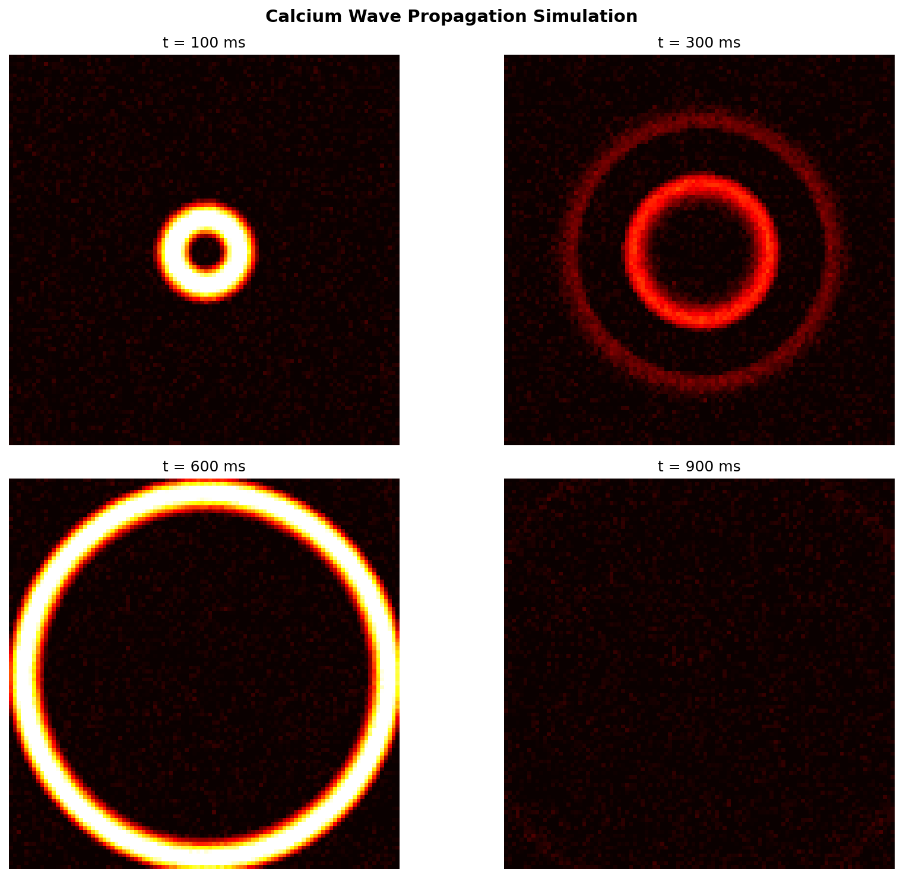

# Calcium Simulator



An interactive 2D intracellular calcium dynamics simulator built with PyQt5 and pyqtgraph. Models the spatiotemporal evolution of calcium concentrations across the cytosol, endoplasmic reticulum (ER), and mitochondria using a reaction-diffusion framework with stochastic IP3 receptor gating.

## Features

### Multi-Compartment Calcium Modeling
- **Cytosolic calcium**: Diffusion, IP3R release, ER leak, SERCA uptake, PMCA extrusion, MCU uptake, and buffering
- **ER calcium**: Depletion through IP3R and leak channels, refilling via SERCA pumps
- **Mitochondrial calcium**: Uptake through mitochondrial calcium uniporter (MCU)
- **IP3 concentration**: Diffusion and degradation dynamics

### Stochastic IP3 Receptor Model
- IP3R channels organized in clusters with configurable density and channels per cluster
- Open/close probabilities depend on local cytosolic calcium and IP3 concentrations
- Stochastic gating produces realistic calcium puffs and waves

### Cell Structure Generation
- Reticulated ER network automatically generated within the cell boundary
- Mitochondria distributed throughout the cytoplasm
- Plasma membrane boundary with PMCA pumps
- IP3R clusters positioned on the ER membrane

### Visualization
- Four tabbed views: Cytoplasmic [Ca2+], ER [Ca2+], Mitochondrial [Ca2+], IP3 concentration
- Overlay toggles for cellular structures (ER, mitochondria, plasma membrane) and IP3R channel states
- Real-time pyqtgraph ImageView displays with adjustable color scales
- Start/stop simulation controls

### Predefined Cell States
- **Default**: Standard resting cell parameters
- **High Calcium**: Elevated cytosolic calcium conditions
- **Low Calcium**: Reduced calcium levels
- Save and load custom parameter sets through the GUI

## Mathematical Model

The core reaction-diffusion equations:

```
d[Ca2+]_cyt/dt = D_Ca * nabla^2[Ca2+]_cyt + J_IP3R + J_leak - J_SERCA - J_PMCA - J_MCU - J_buffer
d[Ca2+]_ER/dt  = -J_IP3R - J_leak + J_SERCA
d[Ca2+]_mito/dt = J_MCU
d[IP3]/dt       = D_IP3 * nabla^2[IP3] - J_degradation
```

### Default Parameters

| Parameter | Symbol | Default Value |
|-----------|--------|---------------|
| Grid size | -- | 200 x 200 |
| Spatial step | dx | 0.1 um |
| Time step | dt | 0.001 s |
| Ca2+ diffusion coeff | D_Ca | 20 um^2/s |
| IP3 diffusion coeff | D_IP3 | 200 um^2/s |
| SERCA pump rate | V_SERCA | 0.4 uM/s |
| SERCA half-max | K_SERCA | 0.2 uM |
| ER leak rate | -- | 0.0002 s^-1 |
| PMCA rate | -- | 0.1 uM/s |
| MCU rate | -- | 0.05 uM/s |
| IP3 degradation rate | -- | 0.1 s^-1 |
| IP3R cluster density | -- | 0.01 |
| IP3R per cluster | -- | 10 |
| IP3R open rate | -- | 0.01 s^-1 |
| IP3R close rate | -- | 10 s^-1 |
| Buffer total | -- | 100 uM |
| Buffer Kd | -- | 0.5 uM |
| Buffer k_on | -- | 100 uM^-1 s^-1 |
| Initial ER [Ca2+] | -- | 500 uM |
| Initial mito [Ca2+] | -- | 0.1 uM |

The 2D diffusion uses a weighted Laplacian kernel:
```
[[0.05, 0.2, 0.05],
 [0.2,  -1,  0.2 ],
 [0.05, 0.2, 0.05]]
```

Equilibrium cytosolic calcium is computed analytically from the balance of SERCA uptake and ER leak at steady state.

## Project Structure

```
calcium_simulator/
  main.py              # Entry point: creates CalciumModel and MainWindow, runs Qt event loop
  calcium_model.py     # CalciumModel class: reaction-diffusion solver, cell structure, IP3R gating
  gui.py               # MainWindow class: tabbed visualization, parameter controls, overlays, menus
  __init__.py          # Package init (re-exports from src subpackage)
  default_state.json   # Default cell state parameters
  high_calcium_state.json
  low_calcium_state.json
```

### Key Classes

| Class | File | Description |
|-------|------|-------------|
| `CalciumModel` | calcium_model.py | Core simulation: grid setup, diffusion, fluxes, IP3R stochastic gating, cell structure |
| `MainWindow` | gui.py | PyQt5 GUI: four ImageView tabs, parameter dock, overlay controls, cell state menu |

## Requirements

- Python 3.7+
- PyQt5
- pyqtgraph
- NumPy
- SciPy
- scikit-image

## Installation

```bash
pip install PyQt5 pyqtgraph numpy scipy scikit-image
```

## Usage

```bash
python main.py
```

1. The main window opens with four visualization tabs (Cytoplasm, ER, Mitochondria, IP3)
2. Adjust simulation parameters in the control dock on the right
3. Click **Start** to run the simulation; click **Stop** to pause
4. Toggle overlay checkboxes to visualize ER network, mitochondria, plasma membrane, and IP3R states
5. Use the **Cell States** menu to load predefined states or save your current configuration
6. Use the **File** menu to save/load parameter sets as JSON files

## Customization

- **Model parameters**: Modify constructor arguments in `calcium_model.py` or adjust via the GUI controls
- **Cell structure**: The `create_cell_structure()` method in `CalciumModel` generates ER and mitochondrial geometry
- **New cell states**: Adjust parameters in the GUI and save through the Cell States menu
- **Visualization**: Modify color scales and overlay rendering in `gui.py`

## License

MIT License


---
*Built with AI assistance from [Claude (Anthropic)](https://claude.com/).*
